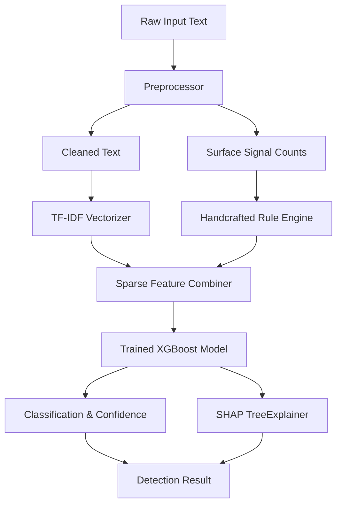
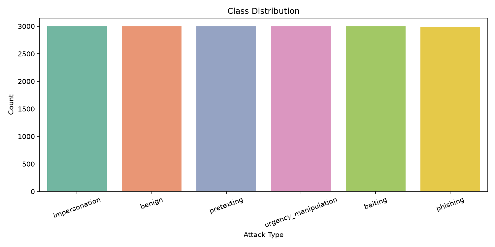
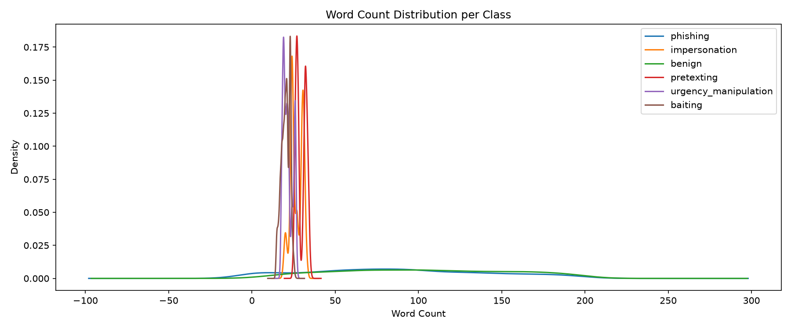
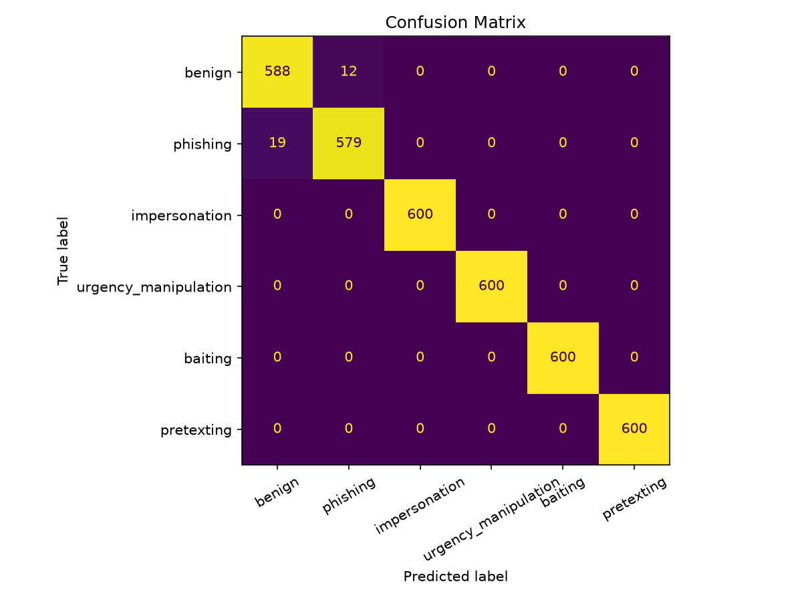
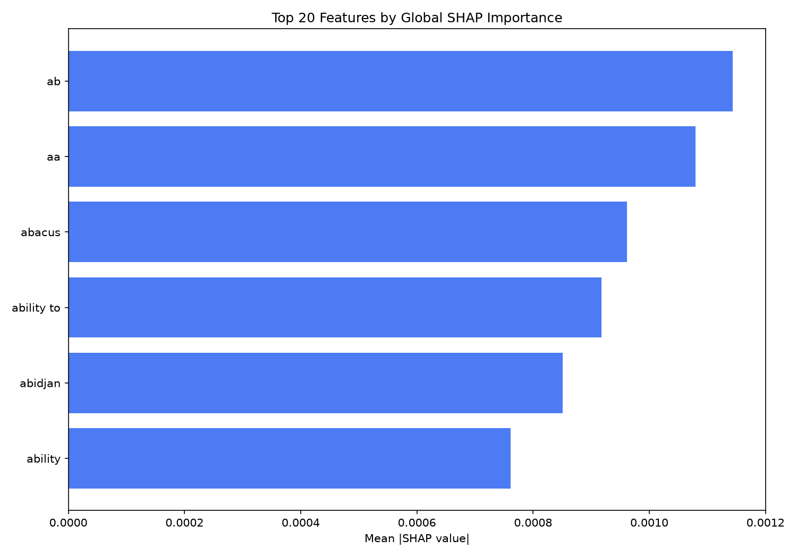

# AI-Driven Social Engineering Detection

An explainable, hybrid machine learning detector designed to classify social engineering attacks. It integrates a deterministic rule engine and a TF-IDF feature pipeline with an XGBoost classifier, supplemented by SHAP (SHapley Additive exPlanations) values for feature-level impact explainability.

---

## 🚀 System Architecture



---

## 📊 Visualizations & Model Performance

The detector was trained on a balanced corpus of **17,989 rows** (~3,000 samples per class) consisting of copied email/SMS data and synthetically generated social engineering attacks. It achieved a **Test F1 Macro of 99.14%**.

### 1. Dataset Class Balance
The dataset is balanced across 6 target classes to prevent prediction bias.



### 2. Word Length Distribution per Class
Long-form emails (benign & phishing) display a wide length variation, while synthetic attack classes are compact (20–30 words).



### 3. Confusion Matrix
The XGBoost model exhibits high classification precision with virtually zero confusion between benign, phishing, and the four social engineering attack vectors.



### 4. Global SHAP Feature Importance
The top 20 features ranked by their absolute SHAP impact values. It illustrates how the model prioritizes structural rule indicators alongside contextual TF-IDF tokens.



---

## 📁 Directory Structure

```
social-engineering-detector/
├── assets/                         # committed visualization plots
│   ├── class_distribution.png
│   ├── word_length_dist.png
│   ├── confusion_matrix.png
│   └── shap_summary.png
├── data/
│   ├── raw/                        # raw source files (gitignored)
│   └── processed/                  # processed training data (gitignored)
├── training/
│   ├── data_prep.py                # copies source data and generates synthetic classes
│   ├── eda.py                      # exploratory data analysis script
│   ├── features.py                 # extracts TF-IDF & handcrafted rule features
│   ├── train.py                    # fits XGBoost and saves model
│   └── evaluate.py                 # handles evaluation and confusion matrix plotting
├── detector/
│   ├── __init__.py                 # exports analyze() and DetectionResult
│   ├── preprocessor.py             # text cleaning and entity extraction
│   ├── rule_engine.py              # extracts 12 handcrafted rule features
│   ├── classifier.py               # wrapper singleton integrating XGBoost and SHAP
│   └── model/                      # saved model files (gitignored)
│       ├── xgb_model.pkl
│       ├── tfidf_vectorizer.pkl
│       └── metadata.json
├── tests/
│   └── test_detector.py            # pytest integration smoke tests
├── .gitignore
├── requirements.txt
└── README.md
```

---

## 🛠️ Setup & Execution

### 1. Clone & Set Up Environment
```bash
python -m venv .venv
.\.venv\Scripts\activate
pip install -r requirements.txt
```

### 2. Run Pipeline & Train Model
```bash
# 1. Copy source datasets & generate synthetic files
python training/data_prep.py

# 2. Run Exploratory Data Analysis
python training/eda.py

# 3. Train the XGBoost model
$env:PYTHONPATH="."
python training/train.py

# 4. Generate SHAP importance plots
python training/run_shap.py
```

### 3. Run Unit Tests
```bash
$env:PYTHONPATH="."
pytest tests/ -v
```

---

## 💻 API Usage

You can import and call the clean module interface in any Python application. It features a rule-assisted fallback to prevent false-positives on standard benign text:

```python
from detector import analyze

text = "URGENT: Your PayPal account has been suspended. Click here to verify your login."
result = analyze(text)

print("Label:", result.label)
print("Confidence:", result.confidence)
print("Risk Score:", result.risk_score)
print("SHAP Top Explanations:", result.shap_top_features)
```
